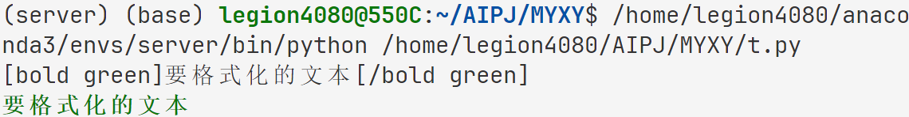

<!-- markdownlint-disable MD033 -->
<!-- markdownlint-disable MD001 -->

# 后端开发文档-配置模块 `src.agent.settings`

该模块实现了一个灵活的配置管理系统，支持多线程环境下的单例模式，允许动态配置和上下文管理。它使用了一个层次化的配置结构，可以根据不同的模块（如基本设置、调试设置、提示设置等）进行配置，并提供了便捷的方法来合并和解析配置项。此外，脚本还包含了样式定义和调试信息输出的功能，以便于在运行时提供可视化反馈和调试信息。

## 样式控制类 `Style` 与 `Formatter`

用于定义富文本格式化的标记。它包含多种文本样式标记（如粗体、颜色、下划线等）和特殊字符符号（如点、方块、箭头等）。类中的 fc 类方法用于将文本应用指定的样式，它接受文本和样式参数，返回带有样式标记的格式化字符串。这个类主要用于在命令行界面中实现文本的样式美化和格式化显示。

```python
from src.modules.agent.settings import Style as sty
from src.modules.agent.settings import Formatter as fmt

rough_str = "要格式化的文本"
styled_str = fmt.fc(rough_str, sty.BG)

print(styled_str)
sty.printf(rough_str, style=sty.BG)
```

<details>

<summary>运行结果</summary>



</details>

- `fc` 函数生成的格式化字符串是基于 `rich` 库的 `Console` 模块。因此只有 `Console` 模块能正确输出格式
- `sty.BG` 是 `Style` 类内部定义的常量之一，代表绿色加粗格式。更多格式见源码

## 静态配置存储类 `Settings`

该模块通过存储若干配置类实现一些参数以及功能的控制。在默认情况下，将加载代码中硬编码的默认配置。在代码中可通过相关的类函数来动态覆盖默认的配置:

```python
from src.modules.agent.settings import settings # 已经在脚本中实例化

print("origin config: ", settings.log.config)

settings.log.configure(enable_debug=True)

print("overrided config: ", settings.log.config)
```

<details>

<summary>运行结果：</summary>

```bash
origin config:  {'enable_chain_visualize': True, 'enable_debug': False, 'enable_info': True}
overrided config:  {'enable_chain_visualize': True, 'enable_debug': True, 'enable_info': True}
```

</details>

`Settings` 类的定义如下：

```python
@dataclass
class Settings:
    """ 存储所有配置的类 """
    base: BaseSettings = BaseSettings()
    lm: BaseSettings = LMSettings()         # 继承 BaseSettings
    debug: BaseSettings = DebugSettings()   # 继承 BaseSettings
    prompt: BaseSettings = PromptSettings() # 继承 BaseSettings
    style: BaseSettings = StyleSettings()   # 继承 BaseSettings

settings = Settings()   # 此处已经完成实例化，可在其他脚本中直接使用
```

- 不同种类的配置存储在不同的类中，这些类都继承自 `BaseSettings` 类，包含了一些基本的配置项。在 `Settings` 类中，通过实例化这些类来存储不同种类的配置。
- `configure` 函数位于 `BaseSettings` 类，用于动态配置，接受一个字典作为参数，将字典中的键值对覆盖到对应的配置项中。

## 动态配置管理类 `RTConfig`

该类是一个运行时配置管理工具，旨在动态地在不同组件之间传递和处理配置信息。它允许用户以字典形式初始化配置，并提供多种方法来获取、合并和解析这些配置。用户可以通过属性和方法访问特定的配置项，支持深拷贝以避免修改原始配置。该工具还具备更新和解析配置的能力，确保在需要时能够获取最新的配置信息。

### 初始化

可以通过传入字典来创建 `RTConfig` 的实例：

```python
from src.modules.agent.settings import RTConfig

initial_config = {
    "setting1": "value1",
    "setting2": {
        "sub_setting1": "sub_value1"
    },
    "setting3": "${setting2.sub_setting1}"
}

runtime_config = RTConfig(initial_config)
```

### 获取配置

用户可以通过调用实例的 `__call__` 方法或直接访问属性来获取配置项。支持通过键路径访问嵌套配置：

```python
# 获取整个配置
full_config_deepcopy = runtime_config()
print(full_config_deepcopy)

# 注意此时返回的是引用！修改 full_config 也会改变 runtime_config 内部 config 的值！
full_config = runtime_config(deep_copy=False)  
full_config.setting1 = "new_value1"
print(runtime_config._config) 

# 获取特定配置项
specific_value = runtime_config("setting2.sub_setting1")
print(specific_value)
```

<details>

<summary>运行结果</summary>

```bash
{'setting1': 'value1', 'setting2': {'sub_setting1': 'sub_value1'}, 'setting3': '${setting2.sub_setting1}'}
{'setting1': 'new_value1', 'setting2': {'sub_setting1': 'sub_value1'}, 'setting3': '${setting2.sub_setting1}'}
sub_value1
```

</details>

### 更新和解析配置

`RTConfig` 提供了 `interpolate` 属性，允许用户获取解析后的配置。如果 `update` 参数为 `True`，则会更新配置：

```python
# 解析并更新配置
# 这个函数也有 deep_copy 参数
resolved_config = runtime_config.interpolate(update=True) 

print(resolved_config)
print(runtime_config._config)
```

<details>

<summary>运行结果</summary>

```bash
{'setting1': 'new_value1', 'setting2': {'sub_setting1': 'sub_value1'}, 'setting3': 'sub_value1'}
{'setting1': 'new_value1', 'setting2': {'sub_setting1': 'sub_value1'}, 'setting3': 'sub_value1'}
```

</details>

### 合并配置

可以使用 `merge` 方法将新的配置与现有配置合并。该方法接受一个字典或另一个 `RTConfig` 实例，并返回合并后的配置副本：

```python
new_config = {
    "setting4": {
        "sub_setting": "new_sub_value"
    }
}

merged_config = runtime_config.merge(new_config)
print(merged_config)
print(runtime_config())
```

<details>

<summary>运行结果</summary>

```bash
{'setting1': 'new_value1', 'setting2': {'sub_setting1': 'sub_value1'}, 'setting3': 'sub_value1', 'setting4': {'sub_setting': 'new_sub_value'}}
{'setting1': 'new_value1', 'setting2': {'sub_setting1': 'sub_value1'}, 'setting3': 'sub_value1'}
```

</details>

### 动态修改配置

通过 `_merge` 方法，用户可以直接在现有配置上进行修改。该方法会更新当前实例的配置，而不是返回副本：

```python
new_config = {
    "setting5": "new_sub_value"
}

merged_config = runtime_config._merge(new_config)
print(merged_config)
print(runtime_config())
```

<details>

<summary>运行结果</summary>

```bash
{'setting1': 'new_value1', 'setting2': {'sub_setting1': 'sub_value1'}, 'setting3': 'sub_value1', 'setting5': 'new_sub_value'}
{'setting1': 'new_value1', 'setting2': {'sub_setting1': 'sub_value1'}, 'setting3': 'sub_value1', 'setting5': 'new_sub_value'}
```

</details>

### 深拷贝配置

使用 `data` 属性可以获取配置的深拷贝，确保对返回的配置进行修改不会影响原始配置：

```python
copied_config = runtime_config.data
print(copied_config)
```

<details>

<summary>运行结果</summary>

```bash
{'setting1': 'new_value1', 'setting2': {'sub_setting1': 'sub_value1'}, 'setting3': 'sub_value1', 'setting5': 'new_sub_value'}
```

</details>

### 布尔值转换

`RTConfig` 还实现了 `__bool__` 方法，允许用户通过布尔上下文检查配置是否为空：

```python
if runtime_config:
    print("配置不为空")
else:
    print("配置为空")
    
if RTConfig():
    print("配置不为空")
else:
    print("配置为空")
```

<details>

<summary>运行结果</summary>

```bash
配置不为空
配置为空
```

</details>

## 调试信息打印

### `info` 函数

```python
def info(*values):
    """ 输出运行信息 """
    if settings.log.enable_info:
        print(*values)
```

### `debug` 函数

```python
def debug(*values):
    """ 输出调试信息 """
    if settings.log.enable_debug:
        print(*values)
```
